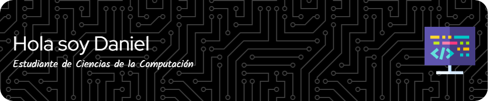

💻 Estudiante de Ciencias de la computación | Interés en el ánalisis de datos y Machine Learning  🤖 

 ***

 
 

 ## ⚡ Datos rápidos sobre mi
  

  - 🌱 Estoy aprendiendo nuevas técnicas de visualización y **análisis de datos**.
- 🔭 Estoy implementando modelos matemáticos de **Machine Learning** en *python*.
- 📫 Contacto: dadad

## Algunas herramientas que uso

 

- 🔭 I’m currently working on ...
- 🌱 I’m currently learning ...
- 👯 I’m looking to collaborate on ...
- 🤔 I’m looking for help with ...
- 💬 Ask me about ...
- 📫 How to reach me: ...
- 😄 Pronouns: ...
- ⚡ Fun fact: ...
-->
